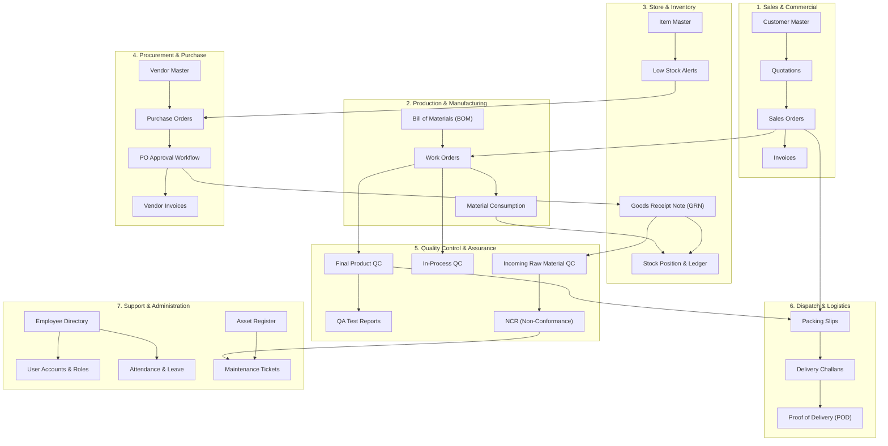

# ERP Nexus — Complete User Guide & Operational Manual

Welcome to **ERP Nexus**, an enterprise-grade, modular Enterprise Resource Planning (ERP) platform built for modern manufacturing, trading, and industrial operations.

This manual provides a comprehensive, step-by-step guide for administrators, managers, operators, and staff to understand how to use each of the 13 integrated operational modules, how data flows between them, and how real-world business workflows operate across the system.

---

## 📐 System Architecture & Inter-Module Relationships

ERP Nexus connects every department in your organization into a single real-time data stream. The diagram below illustrates how information flows between core operational modules:

---

## 📚 Module-by-Module Operational Guide

### 1. 📊 Dashboard & System Analytics
The **Dashboard** serves as the central command hub of ERP Nexus.
- **Dynamic KPI Metric Cards**: Real-time operational figures with live Month-over-Month (MoM) trend percentages:
  - **Sales This Month**: Gross paid revenue in ₹ (INR).
  - **Open Purchase Orders**: Pending & active vendor orders.
  - **Low Stock Items**: Items below safety stock levels.
  - **Open Work Orders**: Active shop floor manufacturing orders.
  - **Pending QA Approvals**: Inspections awaiting sign-off.
  - **Open Maintenance Issues**: Active asset repair tickets.
- **Sales Trend Analytics**: Interactive 12-month revenue chart.
- **Inventory Category Breakdown**: Pie chart of items by category.
- **Live Activity Feed**: Real-time audit trail of all user actions across the system.

---

### 2. 🔐 User Management & Roles (RBAC)
Manage system access, department assignments, and security permissions.
- **User Directory**: View active users, pending user approvals, and user details.
- **Creating / Editing Users**: Assign full names, email addresses, active status, and departments.
- **Department Management**:
  - Select existing departments (HR, Sales, Production, Dispatch, IT, etc.).
  - Click **"+ Add New Department..."** inside any dropdown or use the **Organization Departments** card in Roles & Permissions to create new departments instantly.
- **Role-Based Access Control (RBAC)**: Assign pre-configured roles (Admin, Manager, Staff) or customize granular per-module permissions (View, Create, Edit, Delete).
- **User Approval Flow**: Review pending self-registered users and approve or reject access.

---

### 3. 💼 Sales Management
Manage customer relationships, quotation proposals, sales orders, and revenue collection.
- **Customers Master**: Maintain client contact info, GSTIN/Tax details, addresses, and credit terms.
- **Quotations (`QT-XXXX`)**: Create formal price estimates. Once accepted by the customer, convert a quotation directly into a Sales Order with one click.
- **Sales Orders (`SO-XXXX`)**: Authorize sales fulfillment. Sales Orders automatically reserve inventory or trigger Production Work Orders.
- **Invoices (`INV-XXXX`)**: Generate tax-compliant invoices formatted in Indian Rupee (₹ INR). Track invoice status (`Unpaid`, `Partially Paid`, `Paid`).
- **Sales Reports**: Export sales performance, customer billing history, and revenue trends to CSV.

---

### 4. 🛒 Purchase & Procurement
Manage suppliers, raw material requisitions, purchase orders, and vendor billing.
- **Vendors Master**: Directory of suppliers, payment terms, and vendor performance history.
- **Purchase Orders (`PO-XXXX`)**: Requisition raw materials, packaging, or spare parts.
- **PO Approval Workflow**: Orders above threshold require Manager or Admin approval (`Pending` -> `Approved` / `Rejected`).
- **Vendor Invoices**: Record supplier invoices against issued POs for accounts payable reconciliation.

---

### 5. 📦 Store & Inventory Control
Maintain full traceability over item masters, stock movements, GRNs, and ledger balances.
- **Item Master**: Register inventory items, raw materials, finished goods, packaging, and consumables with reorder thresholds.
- **Goods Receipt Notes (GRN - `GRN-XXXX`)**: Record incoming shipments from suppliers. Submitting a GRN automatically updates item stock levels and generates inventory transaction logs.
- **Low Stock Alerts**: Automatic real-time warning list highlighting items where `current_stock <= reorder_level`.
- **Stock Ledger & Position**: Audit complete historical inventory movements (Receipts, Issues, Adjustments, Transfers).

---

### 6. 🏭 Production & Manufacturing
Plan, schedule, and execute shop-floor manufacturing operations.
- **Bill of Materials (BOM - `BOM-XXXX`)**: Define item structures, component quantities, scrap allowances, and versioning for finished goods.
- **Work Orders (`WO-XXXX`)**: Issue manufacturing orders linked to Sales Orders or stock replenishment.
- **Material Consumption**: Issue raw materials from the store to specific Work Orders. Automatically updates inventory balances.
- **Production Schedule**: Track shop floor progress (`Draft`, `In Progress`, `Completed`).

---

### 7. 🛠️ Maintenance & Asset Management
Ensure machine uptime, equipment reliability, and preventive maintenance.
- **Asset Register**: Maintain machinery records, serial numbers, locations, purchase dates, and warranty status.
- **Preventive Maintenance Schedules**: Schedule recurring maintenance routines (Daily, Weekly, Monthly, Annual).
- **Issue Logging & Repair Tickets**: Log asset breakdowns, assign maintenance staff, track repair progress, and close issues upon completion.

---

### 8. 🔬 Quality Assurance (QA)
Define inspection standards, checklists, and quality compliance reports.
- **QA Checklists**: Create standardized inspection templates per product or category.
- **QA Test Reports**: Log test parameters, pass/fail results, attach lab certificates/photos, and route reports for QA Manager approval.

---

### 9. 🎯 Quality Control (QC)
Enforce quality gates at every stage of the supply chain.
- **Incoming Material QC**: Inspect raw materials against GRNs before store intake.
- **In-Process QC**: Conduct shop floor quality checks during work order execution.
- **Final Product QC**: Inspect finished goods before dispatch authorization.
- **Non-Conformance Reports (NCR - `NCR-XXXX`)**: Quarantine defective materials, record root cause analysis, and log corrective action plans.

---

### 10. 🚚 Dispatch & Logistics
Execute shipment packing, transport documentation, and delivery verification.
- **Packing Slips (`PS-XXXX`)**: Generate packing lists specifying box dimensions, weights, and items packed from Sales Orders.
- **Delivery Challans (`DC-XXXX`)**: Create official transport challans including vehicle numbers, driver details, transporter names, and LR numbers.
- **Proof of Delivery (POD)**: Upload signed customer delivery receipts to mark shipments as complete.

---

### 11. 👥 HR & Employee Self-Service
Manage workforce records, attendance, leave, and staff requests.
- **Employee Directory**: Complete employee profiles, designations, joining dates, contact details, and user account linkages.
- **Attendance Matrix**: Log daily attendance (`Present`, `Absent`, `Half Day`, `On Leave`).
- **Leave Applications**: Staff submit leave requests (`Casual`, `Sick`, `Earned`). Managers review and approve/reject requests against active quotas.
- **Employee Self-Service**: Portal for staff to view attendance, request leave, and update profiles.

---

### 12. 🎨 Design & Engineering
Manage product designs, CAD drawings, revisions, and design tasks.
- **Design Files**: Version-controlled storage for CAD files, PDFs, specifications, and renders.
- **Design Tasks & Kanban**: Track design projects across Kanban stages (`Backlog`, `In Design`, `In Review`, `Approved`).
- **Design Reviews**: Multi-department review and sign-off workflow before release to production.

---

### 13. ⚙️ System Settings & Customization
- **Company Configuration**: Manage company name, tax/GST IDs, logo, address, and contact headers for official printouts.
- **Dual-Theme Engine**: Switch between Dark Mode and Light Mode with interactive persistence.

---

## 🔄 End-to-End Operational Workflows

### Scenario A: Order-to-Cash (Customer Fulfillment)
1. **Sales**: Create Customer -> Issue Quotation (`QT-XXXX`) -> Convert to Sales Order (`SO-XXXX`).
2. **Production**: Create Work Order (`WO-XXXX`) for the Sales Order -> Issue raw materials from Store.
3. **Quality Control**: Conduct Final QC inspection on completed items.
4. **Dispatch**: Generate Packing Slip (`PS-XXXX`) -> Issue Delivery Challan (`DC-XXXX`) -> Ship Goods.
5. **Sales**: Generate Invoice (`INV-XXXX`) -> Record Payment Collection (`Paid`).

---

### Scenario B: Procure-to-Pay (Material Procurement)
1. **Store**: Item stock drops below threshold -> Appears in **Low Stock Alerts**.
2. **Purchase**: Create Purchase Order (`PO-XXXX`) -> Route for Manager Approval.
3. **Store & QC**: Supplier delivers goods -> Create Goods Receipt Note (`GRN-XXXX`) -> Perform Incoming QC Inspection.
4. **Store**: Approved materials automatically increment `current_stock` in Store.
5. **Purchase**: Log Vendor Invoice against PO -> Process Payment.

---

## ❓ Frequently Asked Questions (FAQ)

**Q: How do I add a new department to the system?**  
*A: Admins can add new departments directly inside any department select dropdown by choosing `"+ Add New Department..."`, or centrally via **Roles & Permissions -> Organization Departments**.*

**Q: Are document numbers generated automatically?**  
*A: Yes! All document numbers (`SO-XXXX`, `PO-XXXX`, `INV-XXXX`, `GRN-XXXX`, `WO-XXXX`, `DC-XXXX`, `NCR-XXXX`) follow sequential automatic numbering.*

**Q: Are currency figures shown in Indian Rupees?**  
*A: Yes. All financial figures utilize `formatINR` with standard Indian digit grouping (e.g., `₹1,50,000.00`).*

**Q: Is the system secure for multi-user access?**  
*A: Absolutely. Authentication uses in-memory JWT tokens combined with `httpOnly` secure cookies, rate limiting, and granular RBAC permissions per module.*
